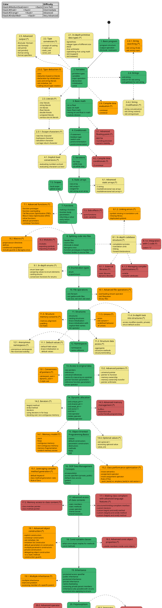

# === C++ Roadmap

## --- Overview

This roadmap was crafted with the intent to craft a comprehensive path for learning C++ language in the most user-friendly manner. As such, the main component of this roadmap is the ***core path*** marked with the *green* color, that leads the reader through all the necessary, fundamental features of the language while limiting the amount of concepts and caveats to grasp.

As for the fact that many of the functionalities moved off of the *core path* are widely utilized and really helpful in most of the more advanced projects, they had been grouped into subjects that could be evaluated in terms of difficulty, and branch off of their related *core path* topic.

## --- Intended approach for the reader

In order to make the best out of this roadmap. it is recommended to:

1. First go through the entire ***core path*** of the roadmap, marked with the *green* color;
2. Introduce topics marked by the *khaki* color;
3. Introduce topics marked by the *orange* color;
4. Introduce topics marked by the *red* color;

The increase in difficulty as per the above list inversely correlates with the frequency at which those features are used in typical projects. This suggests that going up the difficulty chain gradually also promises the biggest skill increase with the least investment.

As real-life software projects vary vastly depending on their application, it must be stated that the priority of features for each and every reader might be different, and you may need to jump around the difficulty chain as need be.

## --- Roadmap

